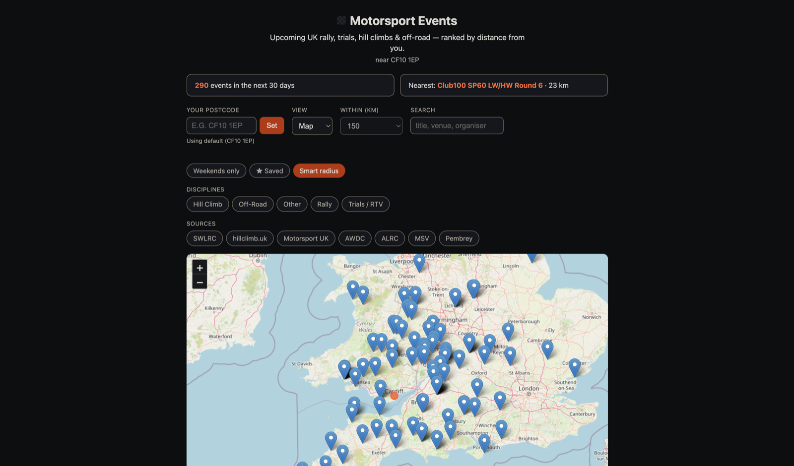

# Motorsport Events

Find upcoming UK motorsport events — **rally, trials/RTV, hill climbs, off-road
and circuit racing** — aggregated from many sources into one calendar and
ranked by distance from your postcode.

> **Live site:** _enable GitHub Pages (Settings → Pages → Source: GitHub
> Actions), then add the URL here._

<!-- Add a screenshot to make this pop:
      -->
_Screenshot: run the SPA locally (below) and drop a `docs/screenshot.png` in._

## Features

- Aggregates 7 sources (AWDC, ALRC, SWLRC, hillclimb.uk, Motorsport UK, MSV,
  Pembrey) with cross-source de-duplication.
- Distance ranking from any UK postcode (geocoded via postcodes.io).
- List, month-calendar and map views.
- Filter by discipline, source, distance, weekend-only, or free-text search.
- "Smart radius" (travel further for a rally than a local trial), saved events,
  new-event badges, and per-event / subscribable calendar (.ics) export.

## How it runs

One codebase, two modes:

- **Static SPA (recommended):** a Python build step scrapes the sources and
  writes `site/events.json`; the browser SPA does all
  filtering/search/distance/mapping client-side. Deployed free to GitHub Pages
  by a scheduled Action — no server at runtime.
- **Local server app (original):** FastAPI + DuckDB serving a dynamic API. Kept
  for local use; see "Local server app" below.

## Run the static SPA

```bash
pip install -r requirements.txt
python -m app.build_site          # writes site/events.json
cd site && python3 -m http.server 8200   # open http://localhost:8200
```

The SPA (`site/index.html` + `app.js` + `style.css`) fetches `events.json`,
geocodes your postcode via postcodes.io in the browser, and computes distances
client-side. `.github/workflows/deploy.yml` rebuilds the data daily and deploys
`site/` to GitHub Pages.

## Quick start (local server app)

```bash
python3 -m venv .venv
source .venv/bin/activate
pip install -r requirements.txt

# Pull events into the local DuckDB database (data/events.duckdb)
python -m app.ingest

# Serve the app
uvicorn app.main:app --reload
# open http://127.0.0.1:8000
```

Re-run `python -m app.ingest` whenever you want to refresh events.

## Keeping data fresh automatically

Two options:

1. Built-in scheduler (one long-lived process):

   ```bash
   python -m app.scheduler                 # refresh every 6 hours
   MSE_REFRESH_HOURS=3 python -m app.scheduler
   ```

   It runs one ingest on startup, then repeats on the interval. Each run's
   per-source result is recorded and shown in the app's "source status" panel
   (and `GET /api/health`).

2. cron / launchd (let the OS drive it):

   ```cron
   # every 6 hours, from the project directory, using its venv
   0 */6 * * * cd /path/to/motorsport-events && .venv/bin/python -m app.ingest >> data/ingest.log 2>&1
   ```

## Tests

```bash
pip install -r requirements-dev.txt
pytest
```

Adapters are tested against saved fixtures in `tests/fixtures/` so the fragile
parsing runs offline and deterministically. Date-dependent logic is tested with
`freezegun`, and the network/retry/pagination paths with `pytest-httpx`.
Coverage is reported automatically (`pytest --cov` is on by default).

### CI / pre-push

A git pre-push hook runs the tests before any push (the "pre-GitHub" gate).
Install it once after cloning:

```bash
./scripts/install-hooks.sh
```

CI runs on both GitHub Actions (`.github/workflows/`, authoritative) and a local
Forgejo instance (`.forgejo/workflows/`, pre-GitHub). See `docs/forgejo.md`.

When a source changes its markup and a parse test fails, re-capture its fixture
(fetch the live page, save it over the old fixture) and update the expected
counts/fields in `tests/test_adapters.py`.

## How it works

```
adapters (per source)  ->  normalize to Event  ->  geocode postcode  ->  DuckDB
                                                          |
                                          distance from home postcode (haversine)
                                                          |
                       FastAPI /api/events  ->  calendar frontend (list + month)
```

- **Storage**: `app/db.py` — DuckDB file at `data/events.duckdb`. Events are
  de-duplicated by `source:source_id`. A `geocache` table stores resolved
  postcodes so we don't re-query the geocoder on every run.
- **Geocoding**: `app/geo.py` — uses the free, keyless [postcodes.io](https://postcodes.io)
  API. Falls back to outcode (e.g. `CF10`) centroid when a full postcode
  doesn't resolve. Distance is a great-circle (haversine) calc from home.
- **Home location / radius**: set in `app/config.py` or via env vars
  (`MSE_HOME_POSTCODE`, `MSE_HOME_LAT`, `MSE_HOME_LON`, `MSE_RADIUS_KM`).

## Adding a real source

Each source is an **adapter** in `app/adapters/`. The base class is `Adapter`;
implement `fetch()` returning a list of `Event`.

Two ready-made paths:

1. **iCal feed** (easiest, most reliable). If a club/calendar publishes an
   `.ics` file, register an `ICalAdapter`:

   ```python
   # app/adapters/__init__.py
   from .ical import ICalAdapter
   from ..models import Discipline

   def all_adapters():
       return [
           ICalAdapter(key="wyewales", name="Wye & Wales LRC",
                       url="https://.../calendar.ics",
                       discipline=Discipline.AWDC),
       ]
   ```

2. **HTML scraper**. Subclass `Adapter`, fetch with `self.make_client()`,
   parse with BeautifulSoup, and emit `Event` objects. Put a postcode in the
   `postcode` field (or let `extract_postcode()` pull one from the venue text)
   so distance ranking works.

Adapters should be resilient — skip a malformed item rather than failing the
whole feed. The ingest runner already isolates each adapter so one failing
source won't break the others.

### Sources on the roadmap
- Motorsport UK calendar (member account — look for an iCal/subscribe export)
- Wye & Wales Land Rover Club fixtures (member area)
- AWDC events
- British Hillclimb / speed championship calendars

### Credentials for member-only sources
Put login details in a local `.env` file (git-ignored). An authenticated
adapter can read them via `os.environ`. Never commit credentials.

## API

- `GET /api/events?start=&end=&discipline=&source=&max_distance_km=&postcode=&search=&weekend=&per_discipline_radius=` — filtered events (each carries `is_new`)
- `GET /api/events.ics?...` — subscribable iCalendar feed of the filtered events
- `GET /api/event/{source}/{source_id}.ics` — single-event calendar download
- `GET /api/summary?days=30&postcode=` — count by discipline + nearest upcoming event
- `GET /api/geocode?postcode=` — resolve a postcode to coordinates (cached)
- `GET /api/health` — per-source ingest status/freshness and total event count
- `GET /api/disciplines` — discipline list for the UI
- `GET /api/sources` — sources that currently have upcoming events
- `GET /api/config` — home location, default radius, per-discipline radii

## Project layout

```
app/
  models.py          Event + Discipline schema
  config.py          paths, home location, radius, HTTP defaults
  db.py              DuckDB storage + geocode cache
  geo.py             postcode geocoding + haversine distance
  ingest.py          run adapters -> geocode -> store  (python -m app.ingest)
  main.py            FastAPI app + static frontend
  adapters/
    base.py          Adapter interface
    ical.py          generic .ics feed adapter
    sample.py        sample data (works out of the box; disable later)
  static/            index.html, style.css, app.js
data/
  events.duckdb      local database (git-ignored)
```
